# Molecule Generation Using GP-MoLFormer

Генерация аналогов энкорафениба с использованием трансформера GP-MoLFormer.

---

## Содержание

- [Описание репозитория](#описание-репозитория)
- [Постановка задачи](#постановка-задачи)
- [Ход работы](#ход-работы)
  - [1. Получение данных об активности из ChEMBL](#1-получение-данных-об-активности-из-chembl)
  - [2. Генерация аналогов с помощью MoLFormer](#2-генерация-аналогов-с-помощью-molformer)
  - [3. Фильтрация и анализ сгенерированных молекул](#3-фильтрация-и-анализ-сгенерированных-молекул)
- [Результаты](#результаты)
- [Зависимости](#зависимости)

---

## Описание репозитория

```
.
├── README.md                                                 # Описание проекта, задача, ход работы и результаты
│
├──  notebooks/
│   ├── Activity_data_for_target_compounds_CHEMBL5145.ipynb   # Извлечение и предобработка данных активности ингибиторов CHEMBL5145 из ChEMBL
│   ├── Generation_of_Encorafenib_analogues.ipynb             # Генерация новых молекул-аналогов с помощью предобученной модели GP-MoLFormer
│   └── Filtering_of_Encorafenib_analogues.ipynb              # Многоэтапный отбор сгенерированных молекул
│
├──  data/
│   ├── chembl.csv                                            # Соединения против B-RAF (CHEMBL5145) 
│   ├── generated_valid_molecules_ENCORAFENIB.csv             # 22 валидные сгенерированные молекулы в формате SMILES после валидации через RDKit
│   └── top10.csv                                             # Финальный список из 10 лучших кандидатов с расчетами их свойств (QED, MW, LogP и др.)
│
└──  visualizations/
    ├── Structure of encorafenib.png                          # 2D-структура исходного препарата Энкорафениб
    ├── Encorafenib fragment.png                              # Фрагмент молекулы энкорафениб - начальная точка генерации
    ├── Effect of temperature on generation.png               # Зависимость валидности и разнообразия молекул от температуры генерации
    ├── Cosine similarity of embeddings in the GP-MoLFormer space.png  # Косинусное сходство эмбеддингов 
    ├── Generic molecules vs encorafenib.png                  # Сравнение физико-химических свойств сгенерированных аналогов и исходной молекулы
    ├── PAINS and Brenk filter.png                            # График для фильтрации соединений с нежелательными токсичными фрагментами
    ├── QED filter.png                                        # Распределение молекул по показателю QED
    ├── SA Score filter.png                                   # Оценка синтетической доступности сгенерированных структур
    ├── PSA filter.png                                        # График для aильтрациb по PSA
    ├── Scaffold leakage check.png                            # Проверка на структурное перекрытие с тренировочными данными (Tanimoto similarity)
    └── Top 10 generated molecules.png                        # Визуализация финальных молекул-кандидатов с ключевыми метриками
```

---

## Постановка задачи

Выбор меланомы в качестве объекта исследования обусловлен сочетанием высокой социальной значимости заболевания и личной мотивацией. Мой опыт столкновения с подозрением на меланому в подростковом возрасте и успешное хирургическое вмешательство подчеркнули важность своевременной диагностики и разработки новых эффективных методов терапии.

Мутация BRAF V600E, нарушающая сигнальный путь MAPK/ERK, встречается примерно в 50% случаев меланомы. Ингибиторы BRAF демонстрируют высокую эффективность в терапии, однако к ним быстро развивается резистентность [De, A., Kouznetsova, V.L. & Tsigelny, I.F. Machine learning enabled elucidation of novel BRAF V600E inhibitors for metastatic melanoma treatment. BMC Methods 2, 31 (2025).].

Так в качестве мишени заболевания была выбрана серин/треонин-протеинкиназа B-raf (CHEMBL5145), а набор ингибиторов (из пункта "Approved Drugs and Clinical Candidates" этого белка в базе ChEMBL): вемурафениб (CHEMBL1229517), регорафениб (CHEMBL1946170), дабрафениб (CHEMBL2028663), энкорафениб (CHEMBL3301612) и сорафениб (CHEMBL1336).

Цель работы - с помощью модели GP-MoLFormer создать структурные аналоги энкорафениба, сохраняющие или улучшающие его лекарственноподобные свойства, но потенциально имеющие лучшие фармакокинетические характеристики.


---

## Ход работы

### 1. Получение данных об активности из ChEMBL

**Ноутбук:** `Activity_data_for_target_compounds_CHEMBL5145.ipynb`

Через API `chembl_webresource_client` были запрошены все измерения **IC50** (в нМ) из биохимических анализов для мишени CHEMBL5145. Для каждого соединения извлекались:
- идентификатор молекулы (`molecule_chembl_id`);
- структура в формате SMILES (`canonical_smiles`);
- значение активности (`standard_value`).

Данные очищались: удалялись строки с пропущенными SMILES или IC50, а значения приводились к числовому формату. Итоговый датасет сохранялся в `chembl.csv`.

---

### 2. Генерация аналогов с помощью GP-MoLFormer

**Ноутбук:** `Generation_of_Encorafenib_analogues.ipynb`

Использовалась связка токенизатора ibm-research/MoLFormer-XL-both-10pct и модели ibm-research/GP-MoLFormer-Uniq - авторегрессионный трансформер, дообученный для генерации уникальных молекул в формате SMILES.

Ход работы:

1. **Извлечение эмбеддингов набора молекул ингибиторов** - кодирование в скрытое пространство модели. Все пять молекул близки в латентном пространстве модели, что подтверждает их принадлежность к одному химическому классу;

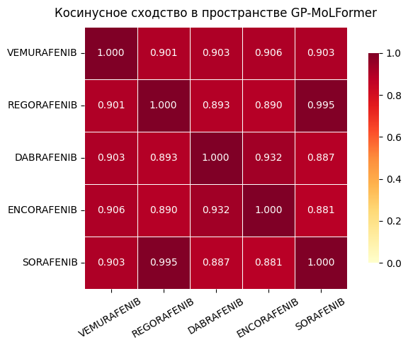

2. **Выбор стартовой точки генерации** - из пяти ингибиторов был выбран энкорафениб по трем критериям:

* наибольшее число тяжелых атомов (наиболее «насыщенная» структура);
* наименьший AlogP (лучшая гидрофильность);
* максимальная полярная площадь поверхности (PSA), что создает потенциал для специфичного связывания новых молекул с мишенью.

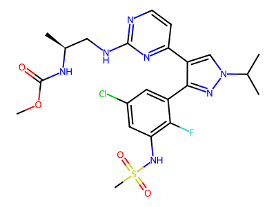

Затем из полной структуры вручную был выделен якорный фрагмент энкорафениба:
COC(=O)N[C@@H](C)CNc1nccc(n1)-c2cn(C(C)C)nc2

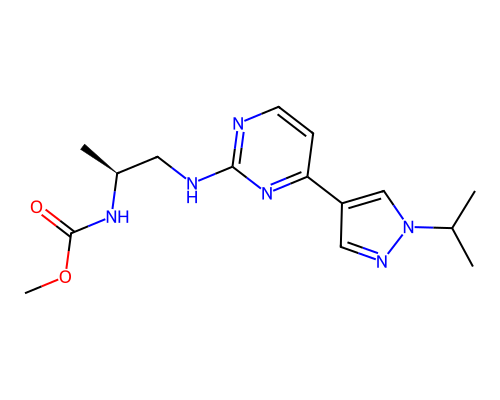

3. **Генерация молекул** - генерация молекул осуществлялась путем авторегрессионного сэмплинга на основе фрагмента энкорафениба. Для каждой температуры из диапазона [0.3–1.1] сгенерировано по 500 молекул (seed=42). 

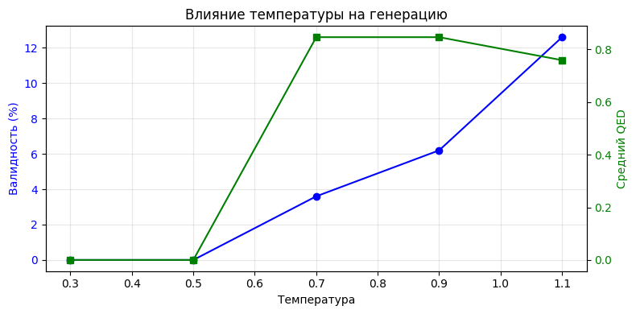

Исследование зависимости валидности и QED от температуры показало, что:

* Низкие температуры (0.3-0.5) неэффективны - в этом диапазоне обе метрики находятся на нулевом уровне

* ритический порог (0.7)- при повышении температуры до 0.7 происходит резкий скачок качества. Средний QED (зеленая линия) мгновенно вырастает до максимального значения (0.85). Валидность (синяя линия) начинает расти, достигая примерно 4%

* Оптимальный диапазон (0.7 – 0.9) - этот интервал выглядит наиболее сбалансированным для качества. Показатель QED остается на пике, а валидность продолжает уверенно расти

* Высокая температура (1.1) - компромисс количества и качества. Валидность достигает своего максимума (примерно 12%). Это значит, что модель генерирует больше валидных объектов. Но средний QED начинает падать (до 0.75). Это говорит о том, что хотя валидных структур становится больше, их лекарственноподобие ухудшается из-за излишней случайности

4. **Отбор валидных структур** - сгенерированные SMILES проверялись через RDKit; невалидные отбрасывались;
5. **Оценка качества** - для каждой валидной молекулы вычислялись:
   - **QED** (Quantitative Estimate of Drug-likeness) - показатель лекарственноподобия;
   - молекулярная масса (MW), липофильность (LogP);
   - косинусное сходство эмбеддинга с эмбеддингом энкорафениба.


В результате было получено 22 уникальные валидные новые молекулы, которые сохранены в `generated_valid_molecules_ENCORAFENIB.csv`.

---

### 3. Фильтрация и анализ сгенерированных молекул

**Ноутбук:** `Filtering_of_Encorafenib_analogues.ipynb`

Сгенерированные молекулы проходили дополнительный отбор различными физико-химическими фильтрами:

1. **Построение QSAR-модели для предсказания биологической активности** - Был обучен бинарный классификатор для предсказания активности молекул против BRAF (порог:  IC50 ≤ 1000 нM (pIC50 ≥ 6)). 

Молекулы представлены в виде векторов из 1033 признаков: конкатенация Morgan fingerprints (радиус 2, 1024 бита) и 9 физико-химических дескрипторов (MW, LogP, PSA, HBD, HBA, nRotB, nAr, Fsp3, QED). Данные были разделены разделены стратифицированно, предварительно проверена утечка скелетов: медианное сходство с тренировочным набором составило 0.554, а молекул с NNS > 0.7 не было обнаружено. 

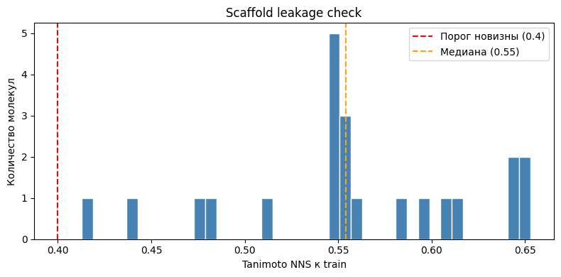

Сравнены Random Forest и Gradient Boosting: лучшую метрику показал Random Forest (Test ROC-AUC = 0.951, F1 = 0.962). Для минимизации ложных срабатываний применен консенсус-фильтр: молекула считается активной только при предсказании вероятности ≥ 0.5 обеими моделями.

После ML-фильтра осталось 22.

2. **Многоступенчатая фильтрация по drug-likeness** - были исследованы четыре критерия:

* Правило Липинского (удалено 4 молеклы);
* Проверка синтетической доступности (удалено 0 молекул) 

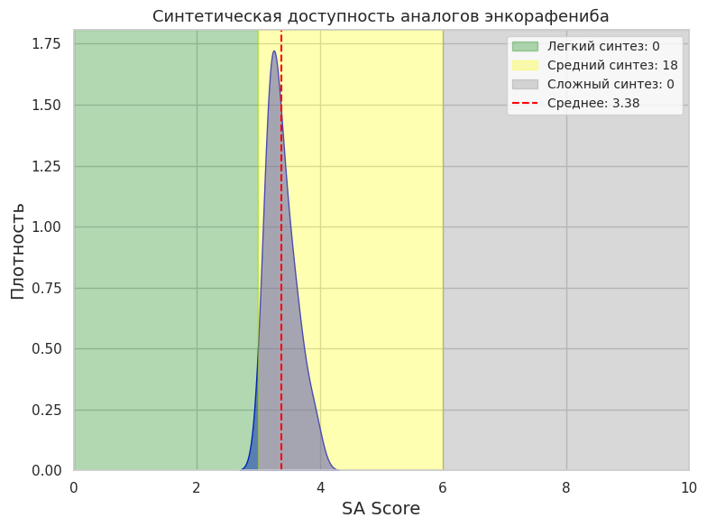

Все проанализированные аналоги энкорафениба имеют средний уровень сложности синтеза;
* Проверка волярной поверхностной площади (удалено 1 молекула)

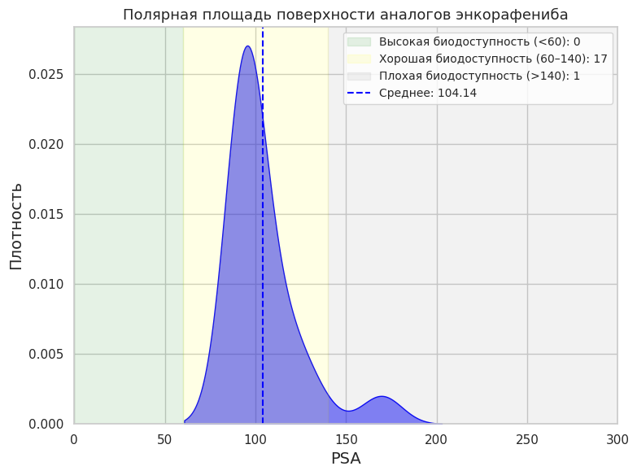

Большинство аналогов имеют полярную площадь поверхности в диапазоне, обеспечивающем хорошую биодоступность. Только одна молекула имеет слишком высокую PSA, что прогнозирует плохую биодоступность

После фильтрации по drug-likeness осталось 17.

3. **Фильтрация токсичности** - были рассмотрены PAINS (0 молекул) и Brenk (2 молекулы).

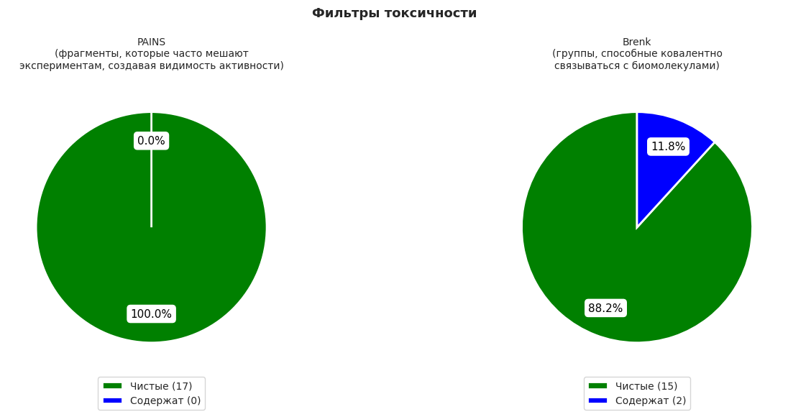

После фильтрации токсичности осталось 15.

4. **Итоговая фильтрация по QED** - большинство молекул являются хорошими кандидатами с высокой лекарноподобностью. Средний показатель QED = 0.73 указывает на высокое качество молекул. Лишь 2 молекулы имеют средние показатели с возможными проблемами. Молекул с низкой пригодностью или идеальной лекарственной сподобностью нет.

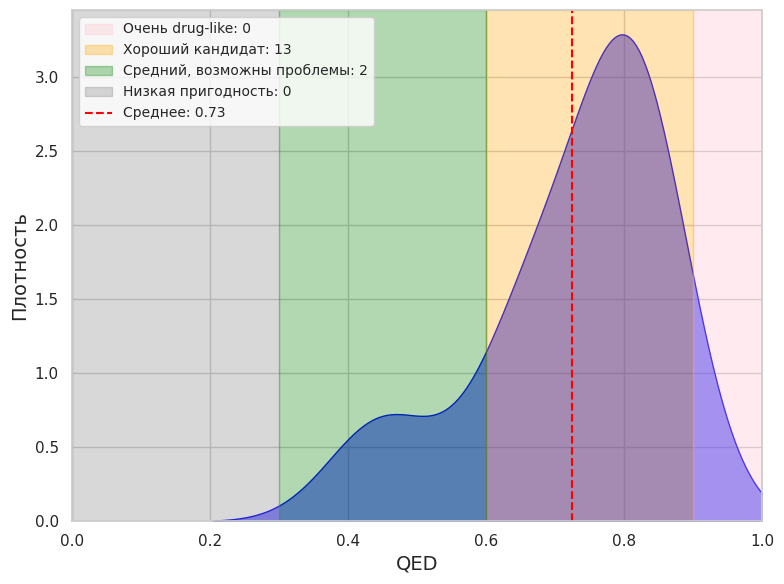

В итоге отбора сгенерированных аналогов энкорафениба осталось 15 молекул.

---

## Результаты

Ранжирование итоговых сгенерированных молекул было проведено по QED, так как эта характеристика агрегирует несколько физико-химических свойств одновременно.

| № | SMILES | MW | LogP | PSA | HBD | HBA | QED | SA_score |
|---|--------|-----|------|-----|-----|-----|-----|----------|
| 11 | `COC(=O)N[C@@H](C)CNc1nccc(-c2cnn(C(C)C)c2)n1` | 318.4 | 2.08 | 94.0 | 2 | 6 | 0.847 | 3.09 |
| 4 | `COC(=O)N[C@@H](C)CNc1nccc(-c2cn(C(C)C)nc2C)n1` | 332.4 | 2.39 | 94.0 | 2 | 6 | 0.843 | 3.15 |
| 7 | `COC(=O)N[C@@H](C)CNc1nccc(-c2cnn(C(C)C)c2)n1.Cl` | 354.8 | 2.50 | 94.0 | 2 | 6 | 0.827 | 3.18 |
| 3 | `COC(=O)N[C@@H](C)CNc1nccc(-c2cn(C(C)C)nc2C#N)n1` | 343.4 | 1.95 | 117.8 | 2 | 7 | 0.823 | 3.41 |
| 13 | `COC.COC(=O)N[C@@H](C)CNc1nccc(-c2cnn(C(C)C)c2)n1` | 364.5 | 2.34 | 103.2 | 2 | 7 | 0.811 | 3.15 |
| 1 | `COC(=O)N[C@@H](C)CNc1nccc(-c2cn(C(C)C)nc2C(C)(...` | 374.5 | 3.37 | 94.0 | 2 | 6 | 0.805 | 3.37 |
| 6 | `COC(=O)N[C@@H](C)CNc1nccc(-c2cn(C(C)C)nc2C(F)(...` | 386.4 | 3.10 | 94.0 | 2 | 6 | 0.792 | 3.37 |
| 5 | `COC(=O)N[C@@H](C)CNc1nccc(-c2cnn(C(C)C)c2)n1.C...` | 391.3 | 2.92 | 94.0 | 2 | 6 | 0.787 | 3.27 |
| 2 | `COC(=O)N[C@@H](C)CNc1nccc(-c2cn(C(C)C)nc2CC#N)n1` | 357.4 | 2.14 | 117.8 | 2 | 7 | 0.779 | 3.53 |
| 9 | `COC(=O)N[C@@H](C)CNc1nccc(-c2cnn(C(C)C)c2)n1.[...` | 353.8 | -0.92 | 94.0 | 2 | 6 | 0.697 | 3.23 |

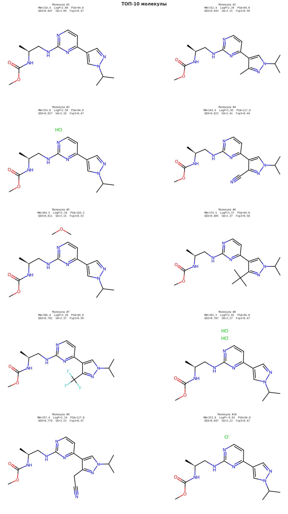

**Сравнение с оригинальной молекулой**

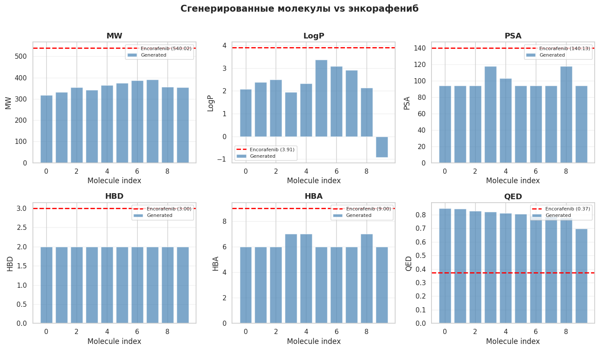

Основные различия в физико-химических свойствах:

Молекулярная масса (MW) - Все сгенерированные молекулы значительно легче энкорафениба

Липофильность (LogP) - Большинство молекул менее липофильны, чем энкорафениб, что может улучшить их растворимость и фармакокинетические свойства

Полярная площадь поверхности (PSA) - Сгенерированные молекулы имеют меньшую PSA по сравнению с энкорафенибом

Водородные связи:

HBD: все молекулы имеют 2 донора водородных связей против 3 у энкорафениба
HBA: 6-7 акцепторов против 9 у энкорафениба
Ключевое преимущество: Все сгенерированные молекулы демонстрируют лучшие показатели QED (0.7-0.85) по сравнению с энкорафенибом (0.37), что указывает на их более высокую пригодность в качестве лекарственных кандидатов

**Общий вывод**

Сгенерированные молекулы представляют собой более оптимизированные структуры с улучшенными drug-like свойствами: они легче, менее полярны, имеют лучшее соответствие правилам лекарство-подобности и потенциально могут обладать улучшенной биодоступностью и фармакокинетикой по сравнению с энкорафенибом.

---

## Зависимости

```
chembl_webresource_client
chembl_structure_pipeline
rdkit
torch
torch_geometric
transformers>=4.36.0,<4.40.0
onnx>=1.15.0
onnxruntime>=1.17.0
moses
pandas
numpy
matplotlib
seaborn
scikit-learn
tqdm
Pillow
sascorer (https://github.com/rdkit/rdkit/blob/master/Contrib/SA_Score/sascorer.py)
```

Все ноутбуки запускались в **Google Colab** (GPU: T4).
